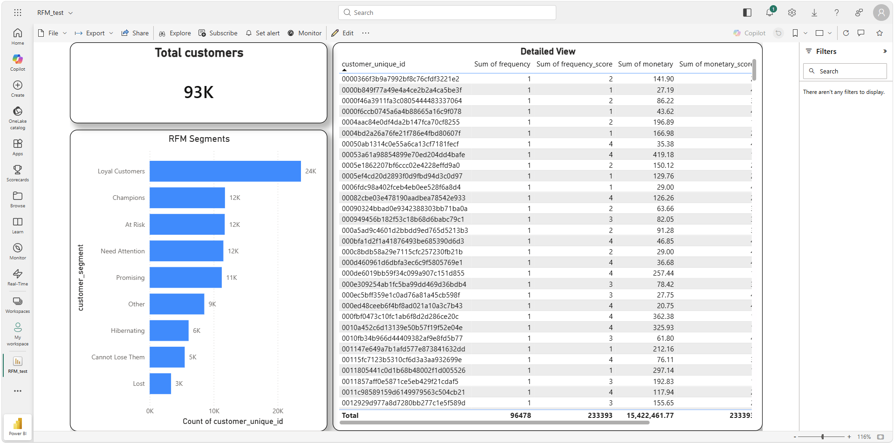

# Olist E-commerce RFM Customer Segmentation

## Project Overview
This project analyzes customer purchasing behavior using RFM (Recency, Frequency, Monetary) analysis for Olist, a Brazilian e-commerce marketplace. The analysis identifies customer segments to drive targeted marketing strategies.

## Tools & Technologies Used

| Layer | Tool |
|---|---|
| Data storage | Google BigQuery |
| Transformation | SQL (BigQuery SQL dialect) |
| Visualisation | Microsoft Power BI |
| Dataset | Olist Brazilian E-Commerce (Kaggle) |

## Business Problem
E-commerce companies need to understand customer value to:
- Retain high-value customers
- Re-engage at-risk customers
- Optimize marketing spend

## Solution
Built an RFM model that:
- Segments 100,000+ customers into 9 segments
- Identifies "Champions" representing top 7% of customers
- Flags "At Risk" customers for retention campaigns

## Dataset

The Olist dataset contains orders placed on a Brazilian marketplace between 2016–2018, spanning 8 relational tables:

- `orders` — order status and timestamps
- `customers` — unique customer identifiers
- `order_items` — products per order
- `payments` — payment values per order
- `reviews`, `products`, `sellers`, `geolocation`

---

## Methodology

### Step 1 — Base View (`olist_rfm_base`)
Joins `orders`, `payments`, and `customers` to produce one row per delivered order with its total payment value.

### Step 2 — RFM Calculation (`olist_rfm_calc`)
Aggregates per customer against a snapshot date of `2018-09-01`:
- **Recency** — days since last purchase
- **Frequency** — number of distinct orders
- **Monetary** — total spend

### Step 3 — Scoring (`olist_rfm_scores`)
Uses `NTILE(4)` window functions to assign each customer an R, F, and M score from 1–4.

### Step 4 — Segmentation (`olist_rfm_segments`)
Maps score combinations to 9 named segments using a `CASE` statement:

| Segment | Logic |
|---|---|
| Champions | Recency = 4, Frequency ≥ 3 |
| Loyal Customers | Recency ≥ 3, Frequency ≥ 2 |
| Promising | Recency ≥ 3, Frequency = 1 |
| Need Attention | Recency = 2, Frequency ≥ 3 |
| At Risk | Recency = 1, Frequency ≥ 3 |
| Cannot Lose Them | Recency = 1, Monetary ≥ 3 |
| Hibernating | Recency = 2, Frequency = 1 |
| Lost | Recency = 1, Frequency = 1 |
| Other | Everything else |

---

## Results

| Metric | Value |
|---|---|
| Total customers analysed | 96,478 |
| Total monetary value | $15,422,461 |
| Number of segments | 9 |

### Segment Breakdown

| Segment | Count |
|---|---|
| Loyal Customers | 24K |
| Champions | 12K |
| At Risk | 12K |
| Need Attention | 12K |
| Promising | 11K |
| Other | 9K |
| Hibernating | 6K |
| Cannot Lose Them | 5K |
| Lost | 3K |

---

## Power BI Dashboard

The dashboard includes:
- **Total customer KPI card** — 93K active customers at a glance
- **RFM Segments bar chart** — count of customers per segment
- **Detailed customer table** — per-customer frequency, monetary, and score breakdown

---

## Key Takeaways

- **Loyal Customers** form the largest segment (24K) — a strong base worth nurturing with retention campaigns.
- **At Risk** customers (12K) represent significant revenue churn risk and are prime candidates for win-back campaigns.
- **Champions** (12K) are the highest-value cohort — ideal targets for referral or loyalty programmes.

---

## How to Reproduce

1. Download the [Olist dataset from Kaggle](https://www.kaggle.com/datasets/olistbr/brazilian-ecommerce)
2. Upload each CSV to BigQuery under a dataset named `olist_project` (table names: `orders`, `customers`, `payments`, `order_items`, `reviews`, `products`, `sellers`, `geolocation`)
3. Run the SQL scripts in order: `rfm_base` → `rfm_calc` → `rfm_scores` → `rfm_total` → `rfm_segments`
4. Connect Power BI to BigQuery and build visuals from `olist_rfm_segments`

## Files in this Repository
- `/sql` - All SQL queries used for RFM calculation
- `/powerbi` - Power BI dashboard file
- `/documentation` - Project screenshots and overview
